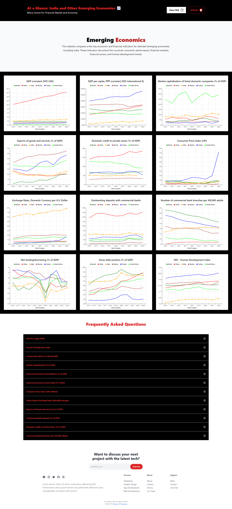

# At a Glance: India and Other Emerging Economies

## [Visit Live Website](https://emerging-economics.devaks.space/)

## Project Overview

Under the guidance of Prof. Sanket Mohapatra (IIM Ahmedabad), we created the website **"At a Glance: India and Other Emerging Economies"** during our 3rd year college internship. This website compares key economic and financial indicators for selected emerging economies, including India. These indicators document the countries' economic performance, financial markets, financial access, and human development trends.



## 🌟 Features

- **Economic Performance:** Track and compare GDP, inflation rates, and other vital statistics
- **Financial Markets:** Overview of stock market indices, bond markets, and other financial data
- **Financial Access:** Analysis of banking penetration, credit availability, and more
- **Human Development Trends:** Compare literacy rates, life expectancy, and other key indicators
- **Real-time Data:** Live data from World Bank, IMF, and UNDP APIs
- **Local Fallback:** JSON data fallback when APIs are unavailable
- **Responsive Design:** Works on desktop, tablet, and mobile devices

## 🛠 Technology Stack

### Backend
- **Node.js** with **Express** framework
- **Axios** for API calls with retry logic
- **CORS** enabled for frontend communication

### Frontend
- **React** with **Vite** build tool
- **TypeScript** for type safety
- **Tailwind CSS** for styling
- **Material-UI** for interactive graphs

### Deployment
- **Docker** containerization
- **Docker Compose** for multi-container management
- **Nginx** reverse proxy
- **Azure VM** cloud hosting
- **SSL/TLS** encryption via Let's Encrypt

## 🚀 Quick Start with Docker Compose

### Prerequisites
- Docker
- Docker Compose

### 1. Clone the Repository
```bash
git clone https://github.com/DEV-AK-Singh/Emerging-Economies.git
cd Emerging-Economies
```

### 2. Start All Services
```bash
docker compose up -d --build
docker compose logs -f
```

### 3. Access the Application
- **Frontend:** http://localhost  
- **Backend:** http://localhost:5000  
- **Health Check:** http://localhost:5000/api/health  

### 4. Stop Services
```bash
docker compose down
```

## 🐳 Docker Services Overview
Service | Port | Description
--- | --- | ---
backend | 5000 | Node.js API server 
frontend | 80 | React UI served by Nginx

## 💻 Manual Development Setup

### Backend
```bash
cd backend
npm install
npm run dev
```

### Frontend
```bash
cd frontend
npm install
npm run dev
```

## 📊 API Documentation

### World Bank
```http
POST /api/worldbank
{
  "indicator": "NY.GDP.MKTP.KD",
  "isLiveData": false
}
```

### World Bank Group
```http
POST /api/worldbankgroup
{
  "indicator": "IMF.CPI.PCPI_PC_CP_A_PT",
  "dataset": "IMF.CPI", 
  "isLiveData": false
}
```

### IMF
```http
POST /api/imf
{
  "indicator": "GGXCNL_G01_GDP_PT",
  "isLiveData": false
}
```

### UNDP
```http
POST /api/undp
{
  "indicator": "hdi",
  "isLiveData": false
}
```

### Health Check
```http
GET /api/health
```

## 📈 Indicators

### World Bank (Indicator)
NY.GDP.MKTP.KD  
NY.GDP.PCAP.PP.KD  
CM.MKT.LCAP.GD.ZS  
NE.EXP.GNFS.ZS  
FS.AST.PRVT.GD.ZS  

### World Bank Group (Indicator | Dataset)
IMF.CPI.PCPI_PC_CP_A_PT | IMF.CPI
IMF.IFS.ENDA_XDC_USD_RATE | IMF.IFS
IMF.FAS.FCLODCG_GDP_PT | IMF.FAS
IMF.FAS.FCBODCA_NUM | IMF.FAS

### IMF
GGXCNL_G01_GDP_PT  
G_XWDG_G01_GDP_PT  

### UNDP
hdi  

## 🔧 Configuration
```
PORT=5000
NODE_ENV=production
UNDP_API_KEY=your_undp_api_key_here
```

## 📁 Project Structure
```
Emerging-Economies/
├── backend/
├── frontend/
├── docker-compose.yml
└── README.md
```

## 🚢 Production Deployment
```bash
docker compose -f docker-compose.yml up -d --build
docker compose logs -f
docker compose ps
```

## 🩺 Health Monitoring
```bash
curl http://localhost:5000/api/health
curl -I http://localhost
docker ps
docker compose logs
```

## 🐛 Troubleshooting

### Containers Not Starting
```bash
sudo systemctl restart docker
docker compose down
docker compose up -d --build
```

### API Timeouts
Use isLiveData: false, check connectivity, firewall.

### Port Conflicts
```bash
sudo netstat -tulpn | grep :80
```

## 📊 Data Sources
World Bank
World Bank Group
IMF  
UNDP  
Local JSON  

## 🤝 Contributing
Fork → Branch → Commit → Push → PR  

## 👥 Contributors
Abhishek Kumar Singh  
Shashank Raghupatro  

## 🙏 Acknowledgments
Prof. Sanket Mohapatra (IIM Ahmedabad)

## 📄 License
Educational & Research Use Only